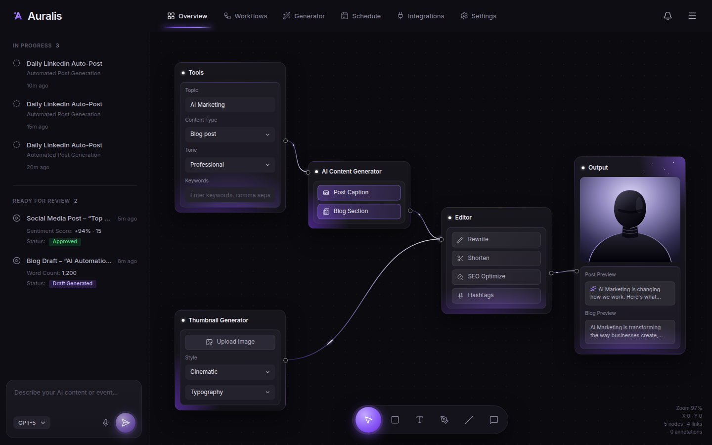

# Auralis — content automation dashboard

A React copy of the Auralis "Overview" dashboard: a dark workflow canvas where
content flows Tools → AI Content Generator → Editor → Output, with a Thumbnail
Generator feeding the Editor. Vite + React 19 + TypeScript, no UI framework.

```
npm install
npm run dev        # http://localhost:5173
npm run build      # typecheck + production build → dist/
npm run preview
```



## What works

- **Canvas**: drag nodes by their body; wires re-route live and carry a
  travelling highlight. Drag empty space (or hold Space) to pan, scroll to pan,
  Ctrl/⌘ + scroll or pinch to zoom around the pointer. Click the stats in the
  bottom-right corner to fit the flow to the screen.
- **Nodes drive the Output**: Topic, Content Type, Tone and Keywords write the
  post and blog previews. Post Caption / Blog Section switch outputs on and off;
  Rewrite, Shorten, SEO Optimize and Hashtags transform the copy. Upload Image
  replaces the thumbnail, Style applies a look, Typography overlays the topic.
- **Toolbar** (V R T P L C): select, rectangle, text, pen, line and comment.
  Esc returns to select, Ctrl/⌘ + Z removes the last annotation.
- **Sidebar**: the prompt box (Enter to run) adds a job to *In progress*; after
  a few seconds it moves to *Ready for review* and the bell gets a dot. The
  menu button toggles the sidebar, which becomes a drawer below 900px.

Nothing is wired to a backend: generation is simulated in `src/App.tsx`, and
preview copy comes from `buildPreviews` in `src/data.ts`. The tabs other than
Overview show a placeholder.

## Layout

```
src/
  App.tsx              shell, tab state, simulated job queue
  data.ts              node positions, edges, seed data, preview copy
  styles.css           all styling; tokens at the top
  components/
    TopNav.tsx         wordmark, tabs, bell, menu
    Sidebar.tsx        In progress / Ready for review
    PromptBox.tsx      prompt, model picker, send
    Canvas.tsx         pan/zoom, node dragging, wires, drawing tools, toolbar
    Nodes.tsx          the five workflow nodes
    NodeCard.tsx       card, ports, field and select primitives
    Portrait.tsx       SVG stand-in for the reference's rendered bust
```

Move nodes or add wires in `INITIAL_NODES` / `EDGES` (`src/data.ts`). Port
heights are set per node in `Nodes.tsx` and measured from the DOM, so cards can
grow without the wires drifting.

## Deploy

On Vercel, import the repo and set **Root Directory** to `auralis-dashboard`;
the included `vercel.json` handles the rest.
