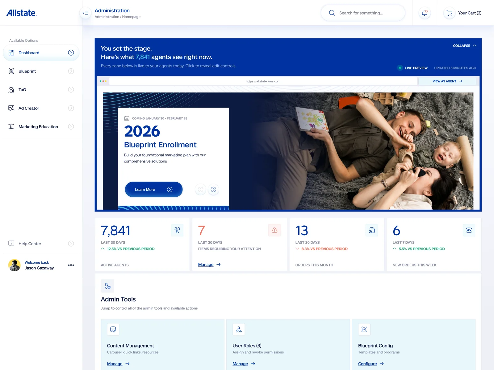
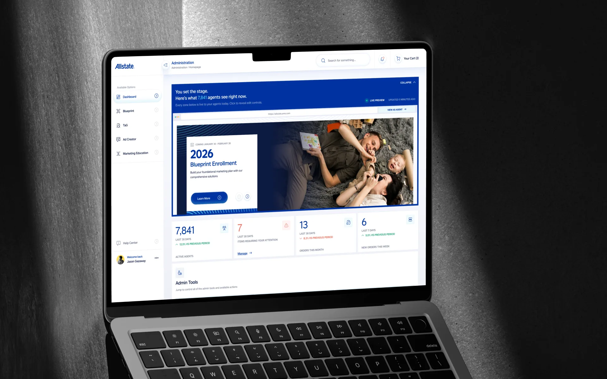
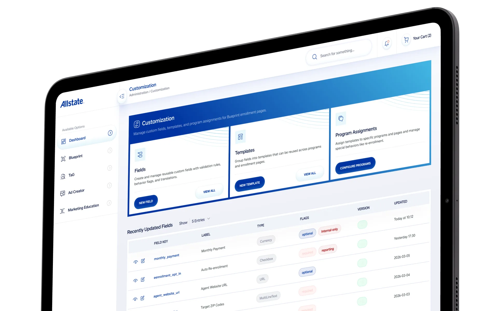
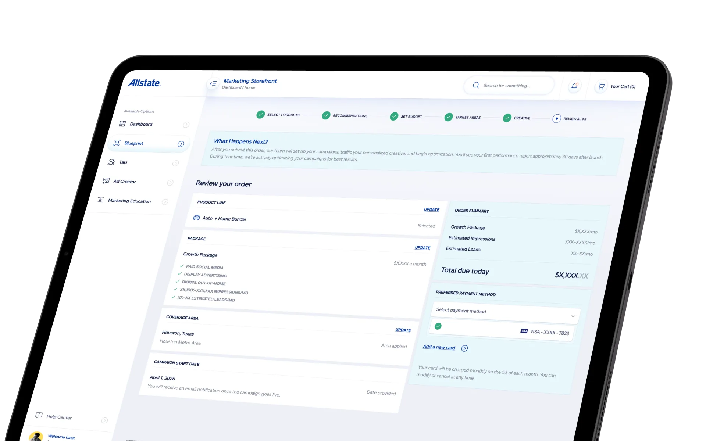

# Allstate – Agent Marketing Tooling on AMS

| | |
|---|---|
| Client | Allstate |
| Region | US |
| Category | Design System |
| Tags | #UX Design #Design System #Front-End Build |

AMS is the marketing platform Allstate's agent network runs on — roughly 7,800 active agents enrolling in programs, ordering campaigns and pulling brand-approved creative. Its core is Blueprint: an annual catalogue of programs and direct-mail campaigns with eligibility, pricing and vendor fulfilment rules behind every line item. I design across the agent-facing flows and the admin tooling that governs them, on Allstate's own AMS design system.

## What the platform does

- Blueprint enrollment — a program catalogue gated by role, state and permission list, with pay-now, deferred and prorated pricing per program
- Marketing Storefront — a guided order: pick products, get recommendations, set budget, target areas, approve creative, pay
- Admin dashboard that previews the live agent homepage, with editable zones and a view-as-agent switch
- Customization — reusable custom fields with validation rules, behaviour flags and translations, grouped into templates and assigned per program
- Enrollment reporting across roll-up, detail and program-coverage views, plus automated vendor enrollment files

## Screens

_Admin dashboard — live preview of what agents see_

_Customization — fields, templates, program assignments_

_Marketing Storefront — guided order and checkout_
