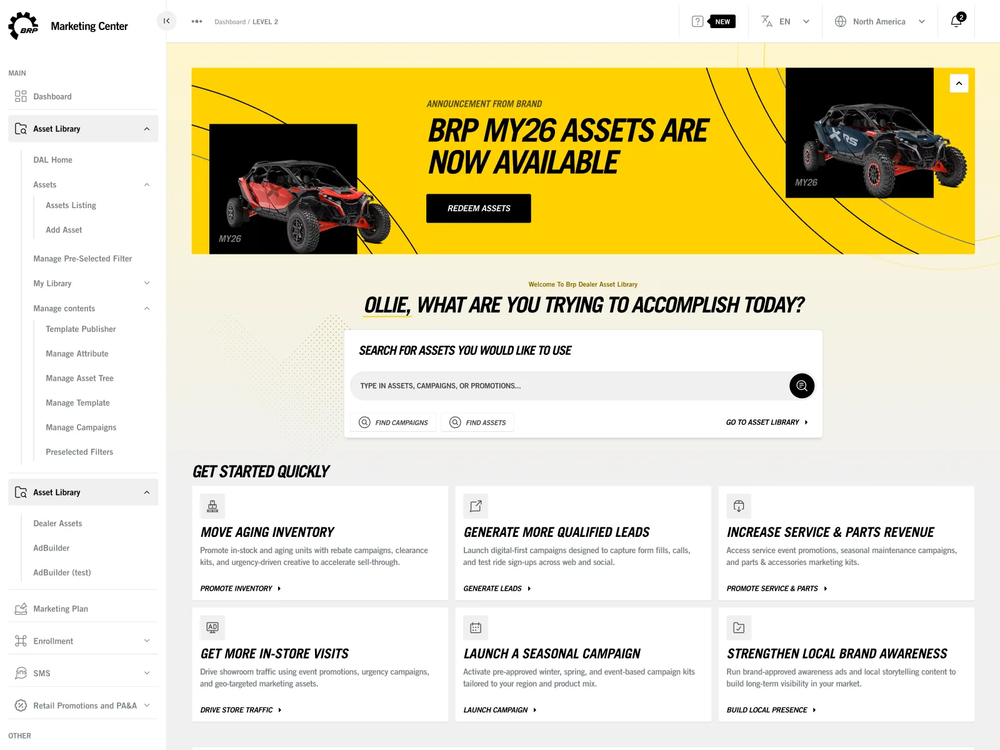
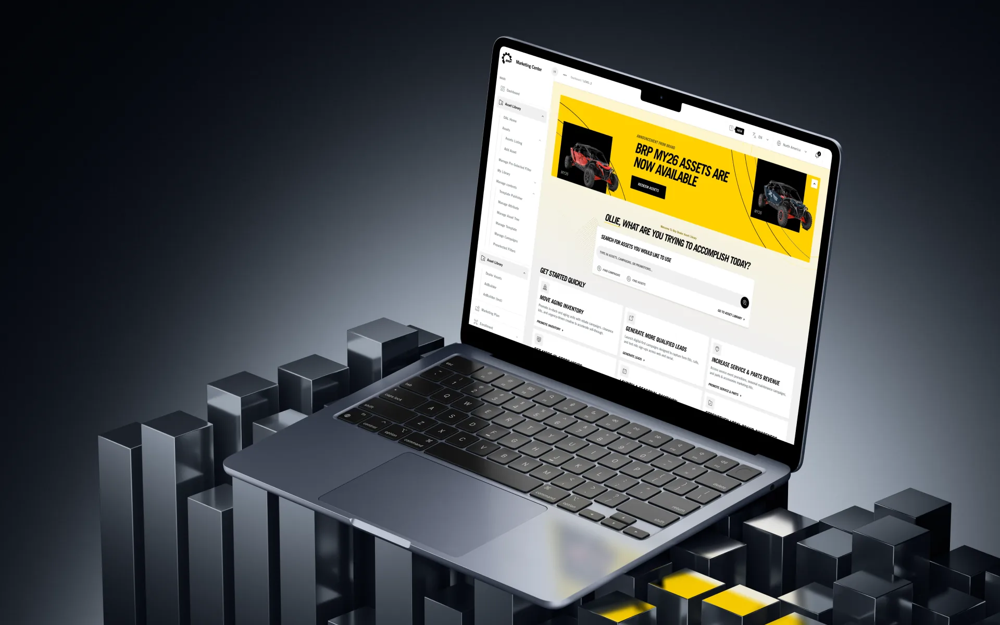
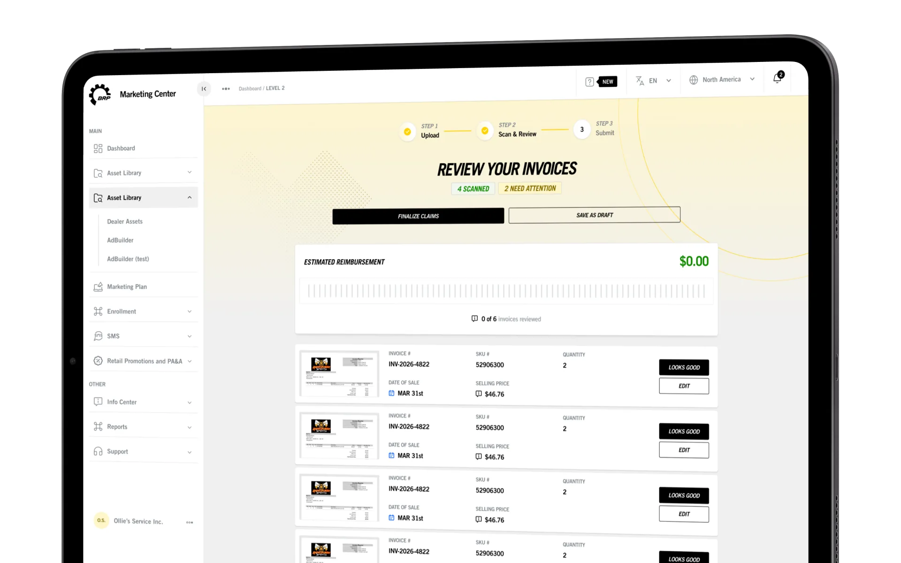
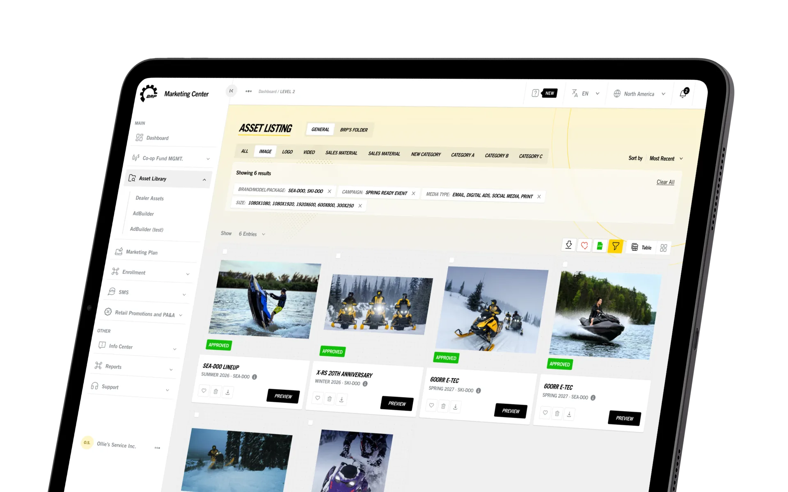

# BRP – Dealer Platform & Marketing Center

| | |
|---|---|
| Client | BRP |
| Region | North America |
| Category | Enterprise |
| Tags | #UX Design #Enterprise #Design System |

BRP Marketing Center is the platform an entire dealer network runs its marketing through — every brand-approved asset, co-op claim, campaign and document, for dealers across North America, Europe and APAC, each in their own language and role. A decade of growth had left every module with its own conventions. I work across it screen by screen, modernising both the flows dealers live in and the admin tooling behind them on BRP 2.0 tokens, so it reads as one product rather than several sharing a login.

## What the platform does

- Dealer Asset Library — brand-approved creative filtered by brand, campaign, media type and size, with previews, favourites, cart downloads and approval states
- Co-op fund management — upload invoices, auto-scan and review the line items, see estimated reimbursement, submit the claim
- Info Center — document and video distribution with previews, per-document links that open without a login, and usage reporting
- Region-, language- and role-aware CMS, so admins retarget landing tiles, banners and navigation without a developer
- AdBuilder, marketing plans, SMS and PA&A rebates in one dealer workspace

## Screens

_Dealer dashboard — task-led entry points_

_PA&A claims — scan, review, submit_

_Asset library — filtered listing_
