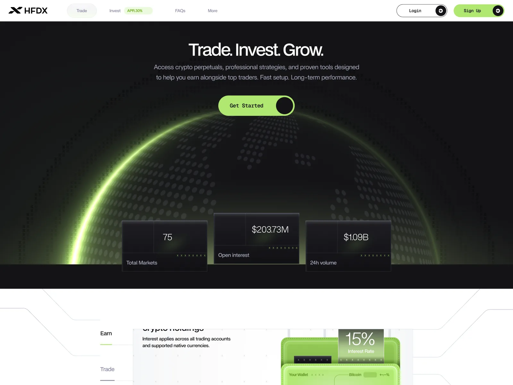
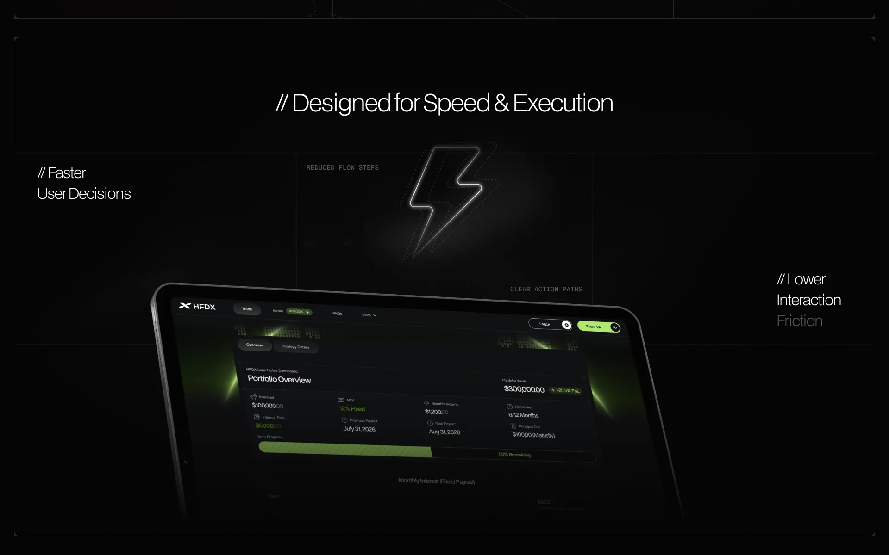
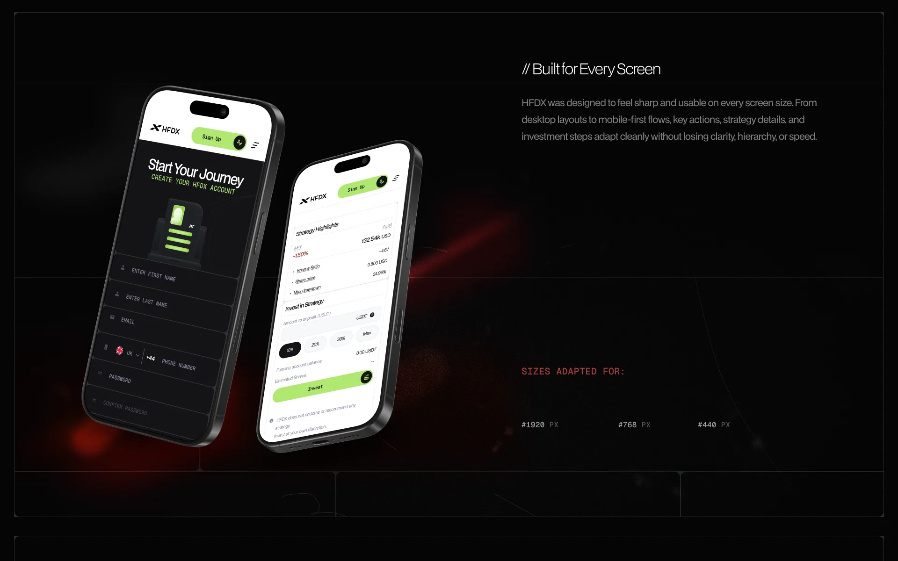
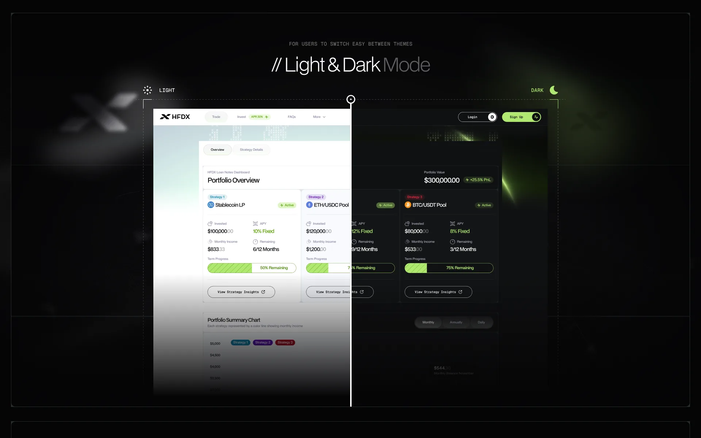

# HFDX – Decentralized Trading Platform

| | |
|---|---|
| Client | HFDX |
| Region | EU |
| Category | Web3 |
| Tags | #Product Design #Web3 #Trading |
| Behance | https://www.behance.net/gallery/252765973/HFDX-Decentralized-Trading-Platform |

HFDX is a decentralised trading platform: crypto perpetuals, managed strategies and fixed-yield loan notes in one product. The hard problem in Web3 is rarely capability, it is legibility — a Sharpe ratio and a max drawdown mean nothing to someone deciding where to put money. The work was structuring those instruments so a deposit takes fewer steps and clearer ones, then carrying that structure across a marketing site, a full product and both themes.

## What the platform does

- Crypto perpetuals across 75 markets, with open interest and 24h volume surfaced up front
- Managed strategies shown on the numbers that decide a deposit — APY, Sharpe ratio, share price, max drawdown
- Fixed-yield loan notes tracked as portfolio value, monthly income, next payout and term progress to maturity
- Invest flow reduced to percentage-of-balance presets, so sizing a position is one tap rather than a calculation
- One system across 1920, 768 and 440px, in both light and dark themes

## Screens

_Landing — markets, open interest, volume_

_Loan notes dashboard — fixed APY and term progress_

_Mobile — onboarding and invest-in-strategy_
