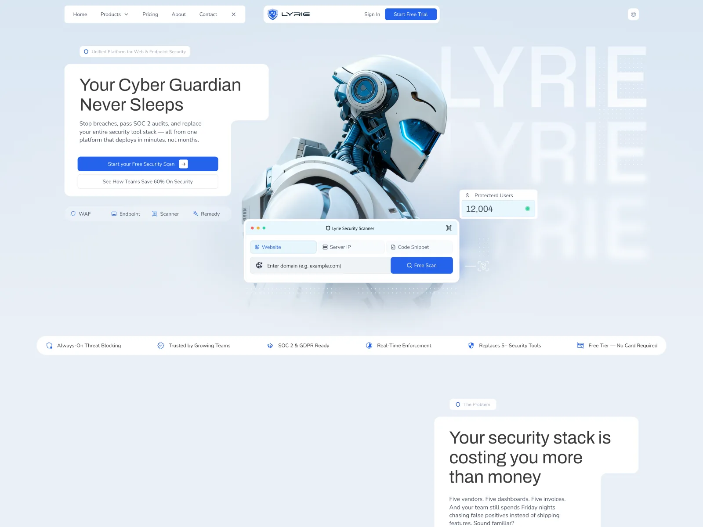
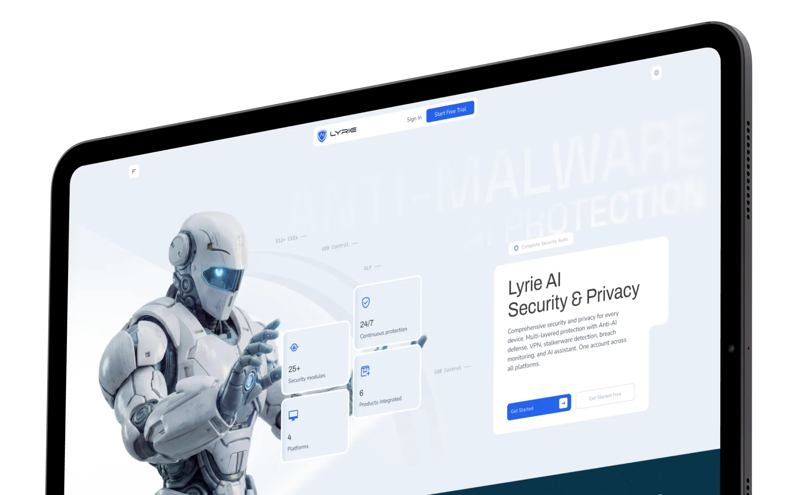
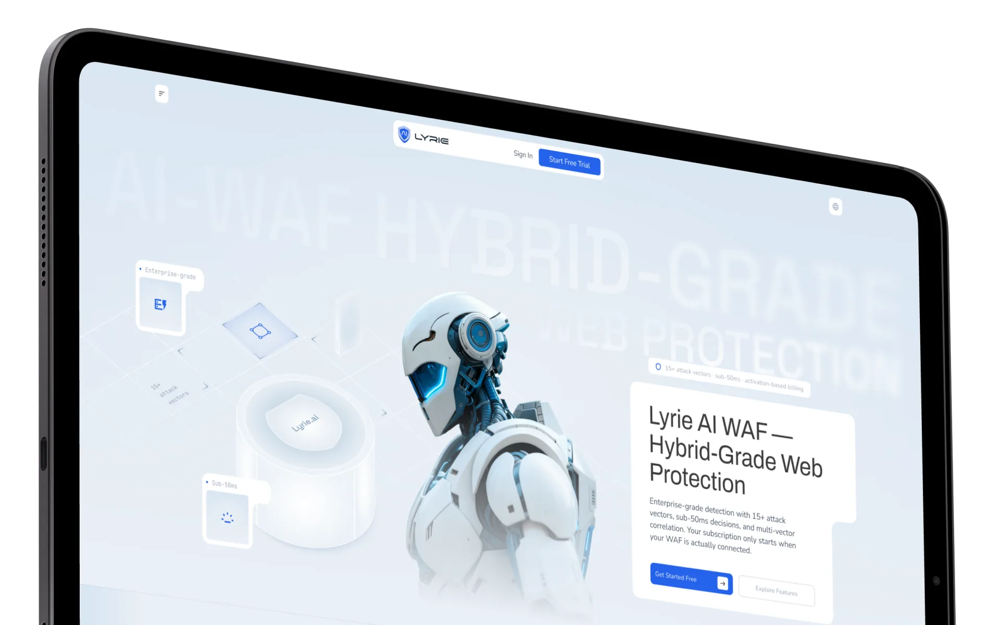
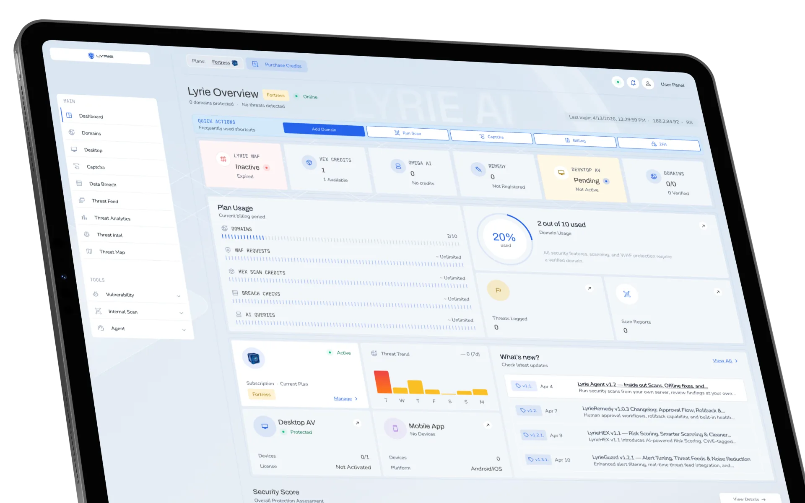

# Lyrie – Cybersecurity Platform & Brand Identity

| | |
|---|---|
| Client | Lyrie |
| Region | EU |
| Category | Cybersecurity |
| Tags | #Brand Identity #Product Design #SaaS |

Lyrie is an AI security platform built to replace a stack, not join one — the pitch it makes is against five vendors, five dashboards and five invoices. A WAF, endpoint protection, scanning and remediation sit behind one account, with SOC 2 and GDPR readiness as the buying trigger. That breadth is the design problem: it has to read premium and technical to an enterprise buyer while staying legible enough that a small team can deploy it in minutes. Brand identity and product were built together, so the dashboard and the marketing site make the same argument.

## What the platform does

- AI WAF covering 15+ attack vectors with sub-50ms decisions and multi-vector correlation — billed only once it is actually connected
- Endpoint and privacy suite: anti-AI defence, stalkerware detection, breach monitoring, USB control, DLP and VPN across four platforms
- Free scanner that takes a domain, server IP or code snippet and returns findings before anyone signs up
- Threat feed, analytics, intel and a live threat map, with vulnerability scans, internal scans and an on-server agent
- Credit-based plans metering domains, scans, breach checks and AI queries, with a security score and in-product changelog

## Screens

_Security & privacy suite — one account, every device_

_AI WAF — hybrid-grade web protection_

_Overview — plan usage, modules, threat trend_
