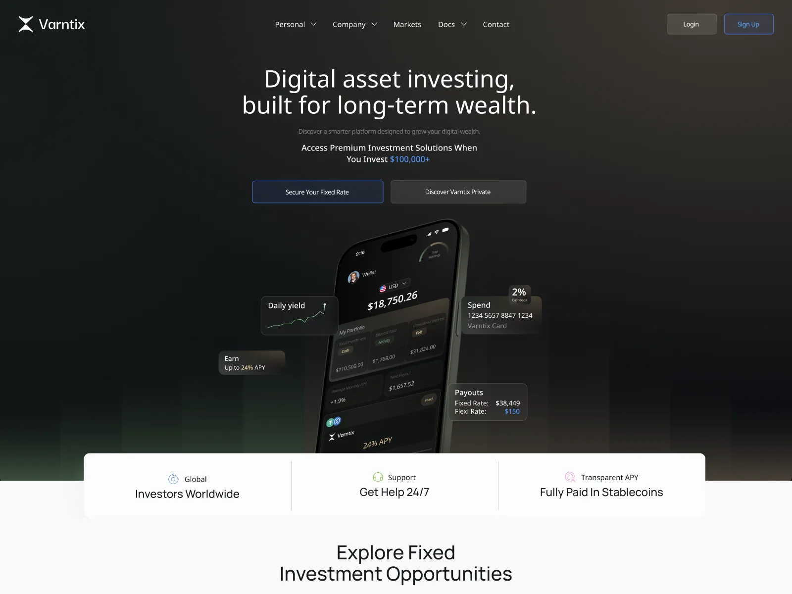
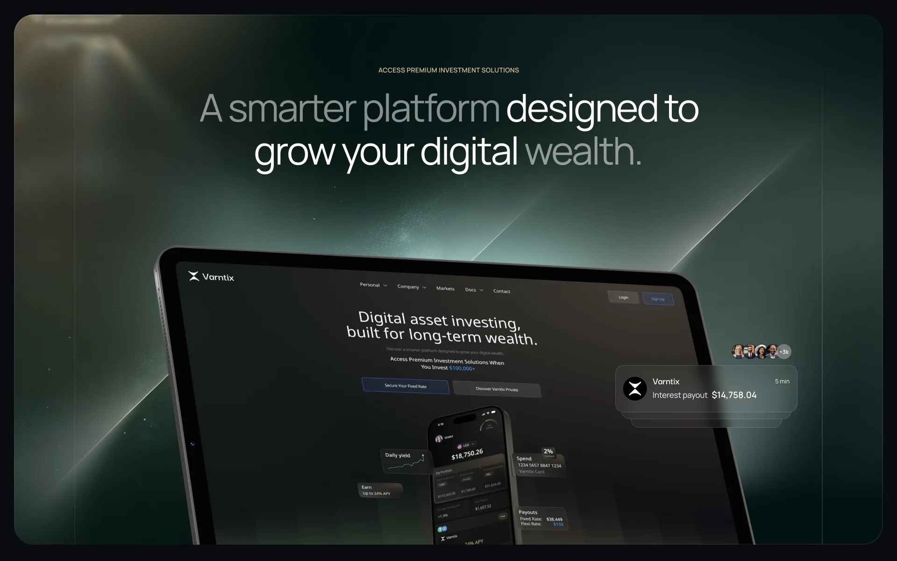
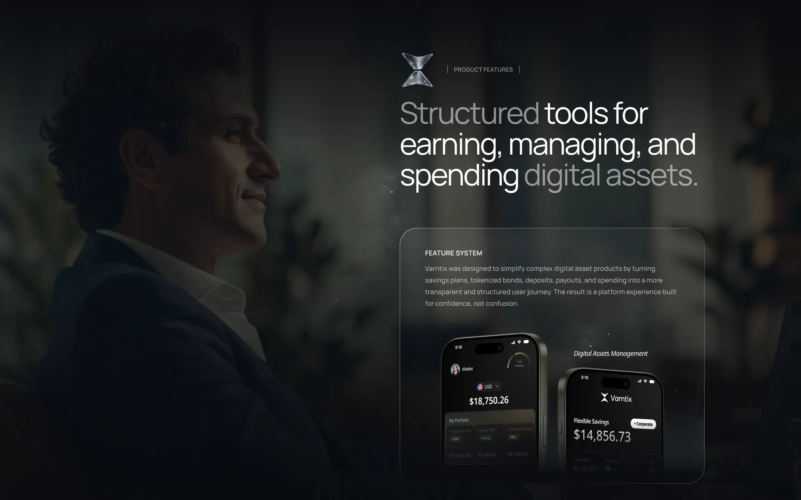
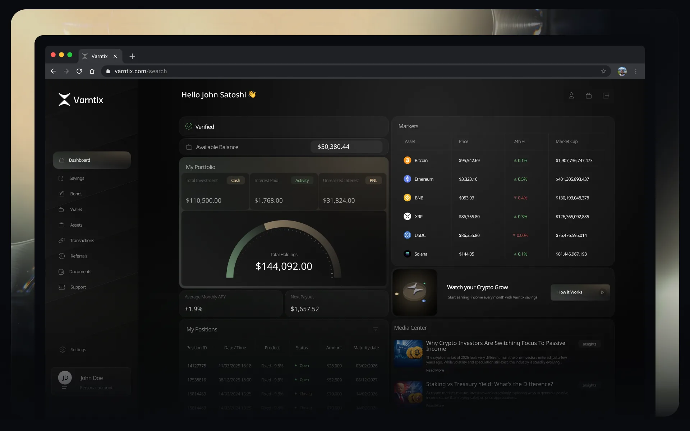

# Varntix – Fintech Product Design

| | |
|---|---|
| Client | Varntix |
| Region | EU |
| Category | Fintech |
| Tags | #Product Design #Fintech #Design System |
| Behance | https://www.behance.net/gallery/252327001/Varntix-Fintech-Product-Design-UX-Case-Study |

Varntix is a digital-asset investment platform: fixed-rate savings, tokenized bonds, a wallet with a spending card, and payouts settled in stablecoins. The design problem is that these are genuinely complicated products, and in fintech trust is the product — so structure, hierarchy and honest data visualisation carried more weight than surface styling. The brief was to make complex instruments legible enough to invest through with confidence. Designed end to end with a team of five at Diversify.

## What the platform does

- Fixed and flexible savings plans with transparent APY, next-payout dates and interest settled in stablecoins
- Tokenized bonds and fixed-term positions, tracked by product, status, amount and maturity date
- Wallet and spending card — balances, cashback and card management alongside the investments funding them
- Investor dashboard reading total holdings, unrealised interest and monthly APY at a glance, beside live market data
- Verification, documents, transactions and referrals — the account plumbing an investment platform is judged on

## Screens

_Positioning — premium investment solutions_

_Feature system — earn, manage, spend_

_Investor dashboard — holdings, positions, markets_
